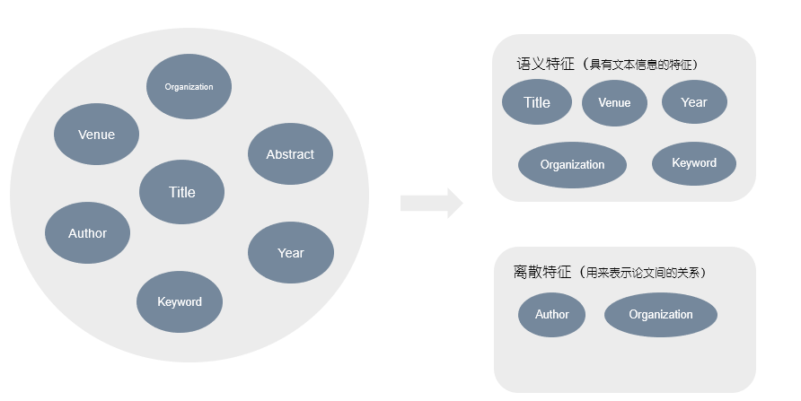
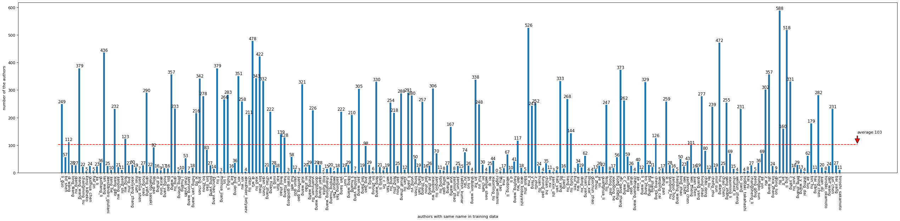
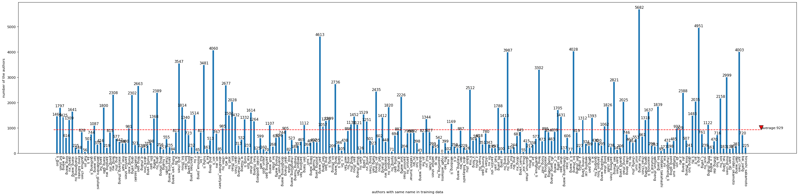
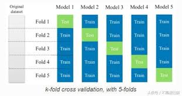
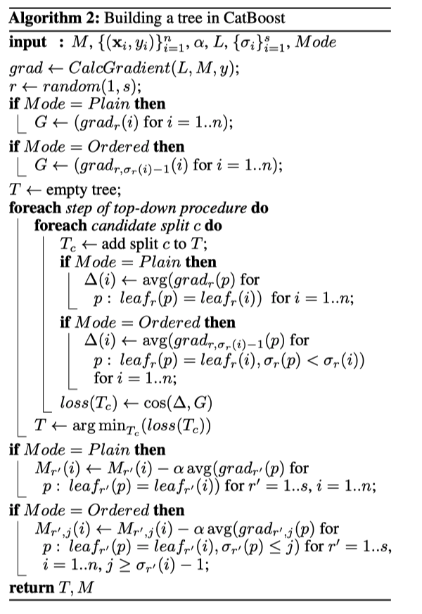

## OAG-WhoIsWho 

### 赛道一 论文的冷启动消歧 & 赛道二 论文的增量消歧


<br>

### 前言：

&emsp;本次project主要参与了人名排歧大赛，同时参与了赛道一(论文的冷启动消歧)和赛道二(论文的增量消歧)。二者之间既有相关性，又有很大的不同，赛道一为聚类问题，赛道二为分类问题，根据课程的学习，使用多种聚类算法以及集成学习分类算法对比赛进行了深入的研究。

&emsp;赛道一和赛道二的数据具有一部分的公共数据，即使用了共同的论文元数据和训练集，首先需要对数据集进行分析，然后构造特征，对特征分析如下：

&emsp;数据中主要包含了如下信息：organization，Venue，Title，Abstract，Year，keyword，author等，对特征进行分析，得知数据主要分为以下两类，即语义特征和离散特征，所谓语义特征，即指具有文本信息的特征，如title，Venue，year,organization以及keyword；对于离散特征，指用于表示论文之间的关系，如author和organization。

如下图所示：




赛道一为论文冷启动消歧：所谓冷启动，即在没有先验知识背景下对同名作者进行消歧。消歧任务解决方案如下：

1. 首先进行特征分析以及数据预处理，对文本特征进行数据清洗；

2. 手动构造特征或者进行论文特征学习（包括对于论文关系的特征学习以及语义特征学习）。

3. 使用DBSCAN等聚类方法进行聚类，相似度计算方法可以自己构建和定义。

赛道二为论文的增量消歧，消歧任务解决方法主要如下：

1. 首先保存提取的信息以及需要使用的数据信息，保存为pkl文件方便使用。

2. 根据特征工程相关知识构造语义特征和数据特征。

3. 使用Catboost分类器以及k-fold交叉验证的方式，基于自己构建的新训练集训练模型，并在验证集和测试集上进行预测。

4. 进阶方案：使用word2vec以及triplet loss做embedding，构造特征，使用Catboost，XGboost，Random Forset，LGBM进行集成，结合多个集成学习算法的平均值，预测最终的结果。

如下图：


<br>


### 一、背景介绍

<br>

&emsp;在许多应用中，同名消歧 (Name Disambiguation - aiming at disambiguating WhoIsWho) 一直被视为一个具有挑战性的问题，如科学文献管理、人物搜索、社交网络分析等，同时，随着科学文献的大量增长，使得该问题的解决变得愈加困难与紧迫。尽管同名消歧已经在学术界和工业界被大量研究，但由于数据的杂乱以及同名情景十分复杂，导致该问题仍未能很好解决。

<br>

### 二、问题描述

<br>

&emsp;收录各种论文的线上学术搜索系统(例Google Scholar, Dblp和AMiner等)已经成为目前全球学术界重要且最受欢迎的学术交流以及论文搜索平台。然而由于论文分配算法的局限性，现有的学术系统内部存在着大量的论文分配错误；此外，每天都会有大量新论文进入系统。故如何准确快速的将论文分配到系统中已有作者档案以及维护作者档案的一致性，是现有的线上学术系统亟待解决的难题。

&emsp;由于学术系统内部的数据十分巨大（AMiner大约有130，000，000作者档案，以及超过200，000，000篇论文），导致作者同名情景十分复杂，要快速且准确的解决同名消歧问题还是有很大的障碍。

&emsp;竞赛希望提出一种解决问题的模型，可以根据论文的详细信息以及作者与论文之间的联系，去区分属于不同作者的同名论文，获得良好的论文消歧结果。而良好的消歧结果是确保学术系统中，专家知识搜索有效性、数字图书馆的高质量内容管理以及个性化学术服务的重要前提，也可影响到其他相关领域。

<br>

### 三、赛题描述

<br>

#### 3.1 OAG-WhoIsWho论文消歧任务

##### I. 论文的冷启动消歧(Name Disambiguation from Scratch)

&emsp;**任务描述**：给定一堆拥有同名作者的论文，要求返回一组论文聚类，使得一个聚类内部的论文都是一个人的，不同聚类间的论文不属于一个人。最终目的是识别出哪些同名作者的论文属于同一个人。


&emsp;**参考方法**：解决这一问题的常用思路就是通过聚类算法，提取论文特征，定义聚类相似度度量，从而将一堆论文聚成的几类论文，使得聚类内部论文尽可能相似，而类间论文有较大不同，最终可以将每一类论文看成属于同一个人的论文。[7] 是一篇经典的使用聚类方法的论文，它使用了原子聚类的思想，大致思路是首先用较强的规则进行聚类，例如：俩篇论文如果有俩个以上的共同作者，那么这俩篇论文属于同一类，这样可以保证聚类内部的准确率，随后用弱规则将先前的聚类合并，从而提高召回率。有些工作考虑了传统特征的局限性，所以利用了低维语义空间的向量表示方法，通过将论文映射成低维空间的向量表示，从而基于向量使用聚类方法 [1]。

##### 评估方法：使用Macro Pairwise-F1作为模型评估度量：

<center>
	PairwisePrecision = #PairsCorrectlyPredictedToSameAuthor / #TotalPairsPredictedToSameAuthor，

	PairwiseRecall = #PairsCorrectlyPredictedToSameAuthor / #TotalPairsToSameAuthor，
	
	PairwiseF1 = 2 * (PairwisePrecision + PairwiseRecall) / (PairwisePrecision + PairwiseRecall)。
</center>

##### II. 论文的增量消歧（Continuous Name Disambiguation）

&emsp;**任务描述**：线上系统每天会新增大量的论文，如何准确快速的将论文分配到系统中已有作者档案，这是线上学术系统最亟待解决的问题。所以问题抽象定义为：给定一批新增论文以及系统已有的作者论文集，最终目的是把新增论文分配到正确的作者档案中。

&emsp;**参考方法**：增量消歧任务与冷启动消歧的任务不同，它是基于有一定作者档案的基础，对新增论文进行分配。所以，容易直接想到的方法就是将已有的作者档案与新增论文进行比较，提取合作者，单位机构或者会议期刊之间相似度的传统特征，随后利用svm之类的传统分类器进行分类。还可以利用基于低维空间的向量表示方法，通过将作者与论文表示成低维向量，使用监督学习方法进行特征提取及模型训练。 

##### 评估方法：使用WeightedF1 作为模型评估度量。

<center>

对每个作者：

Precision = #PapersCorrectlyPredictedToTheAuthor / #TotalPapersPredictedToTheAuthor

Recall = #PapersCorrectlyPredictedToTheAuthor / #TotalPapersToTheAuthor

Weight = #UnassignedPapersOfTheAuthor / #TotalUnassignedPaper

 

对所有作者(M is the number of authors)：

WeightedPrecision = sum(i =1,2, ... ,M) Precision_i * Weight_i

WeightedRecall = sum(i =1,2, ... ,M) Recall_i * Weight_i

WeightedF1 = 2 * (WeightedPrecision + WeightedRecall) / (WeightedPrecision + WeightedRecall)

</center>
<br>

### 四、数据集介绍

##### 4.1 训练集

###### 1. train_author.json

&emsp;**数据格式**：此文件中的数据组织成一个字典（dictionary, 记为dic1），存储为JSON对象。 dic1的键（key）是作者姓名。 dic1的值（value）是表示作者的字典（记为dic2）。 dic2的键（key）是作者ID， dic2的值（value）是该作者的论文ID列表。

###### 2. train_pub.json

此文件包含train_author.json所有论文的元数据，数据存储为JSON对象；

&emsp;**数据格式**：此文件的数据表示为一个字典（dictionary），其键（key）是论文ID，其值是相应的论文信息。 每篇论文的数据格式如下：


##### 4.2 验证集

##### I. 论文的冷启动消歧（Name Disambiguation from Scratch）

###### 1. sna_valid_author_raw.json 

&emsp;二级字典，key值为作者姓名，value为一个论文的list，代表该作者姓名下所有同名作者的论文,参赛者需要将同名作者的论文聚成不同的类簇。

###### 2. sna_valid_pub.json 

&emsp;二级字典，代表验证集所有论文的元信息，格式同train_pub.json。


###### 3. sna_valid_example_evaluation_scratch.json

&emsp;示例提交文件，组织成二级字典格式，key值为作者姓名， value值是一个二维列表，第一维的长度代表类簇的数目，第二维代表各个类簇的论文ids。

###### 4. sna_valid_author_ground_truth.json

&emsp;sna_valid_author_raw.json聚类结果的答案;


##### II. 论文的增量消歧（Continuous Name Disambiguation）


##### 已存在的作者档案：

###### 1. whole_author_profile.json

&emsp;二级字典，key值为作者id，value分为俩个域: ‘name’域代表作者名，’papers’域代表作者的所拥有的论文(作者的profile), 测试集与验证集使用同一个已有的作者档案；

###### 2. whole_author_profile_pub.json

&emsp;whole_author_profile.json中涉及的论文元信息，格式同train_pub.json;

##### 待分配的论文集：

###### 1. cna_valid_unass_competition.json

&emsp;论文列表，代表待分配的论文list，列表中的元素为论文id + ‘-’ + 需要分配的作者index(从0开始)；参赛者需要将该文件中的每篇论文的待分配作者对应分配到已有作者档案中(whole_author_profile.json).


**举例**：
cna_valid_unass_competition.json的论文’F3Mha4HG-3’，代表的意义是，论文’F3Mha4HG’的第3+1位作者(下标从0开始)需要被分配到对应whole_author_profile中的一个作者档案中。此时你需要去cna_valid_pub中找到论文F3Mha4HG的信息，随后可以看到第4位待分配的作者是：

```json
            {
                "name": "Lei Shi",
                "org": "State Key Laboratory of Catalysis"
            }
```

此时要做的就是把这篇论文，分到whole_autho_profile中的正确对应该论文中的‘Lei Shi’的作者档案中。

###### 2. valid_example_evaluation_continuous.json

&emsp;示例提交文件。二级字典，key值为作者 ID，value 值代表分配到该作者的论文id（来自cna_valid_unass_competition.json）。

###### 3. cna_valid_pub.json

&emsp;cna_valid_unass_competition.json中所涉及的论文元信息，格式同train_pub.json。


##### 4.4 测试集

##### I. 论文的冷启动消歧（Name Disambiguation from Scratch）

###### 1. sna_test_author_raw.json​ 

&emsp;二级字典，key值为作者姓名，value为一个论文的list，代表该作者姓名下所有同名作者的论文, 参赛者需要将同名作者的论文聚成不同的类簇。

###### 2. sna_test_pub.json

&emsp;二级字典，代表验证集所有论文的元信息，格式同train_pub.json.

##### II. 论文的增量消歧（Continuous Name Disambiguation）

###### 1. cna_test_unass_competition.json 

&emsp;论文列表，代表待分配的论文list，列表中的元素为论文id + ‘-’ + 需要分配的作者index(从0开始)；参赛者需要将该文件中的每篇论文的待分配作者对应分配到已有作者档案中(whole_author_profile.json).

###### 2. cna_test_pub.json 

&emsp;cna_test_unass_competition.json中所涉及的论文元信息，格式同train_pub.json。


### 五、解决方案

#### I. 论文的冷启动消歧（Name Disambiguation from Scratch）   

##### 1. 训练集分析     

首先，对训练集数据进行分析，通过，简单统计，我们得知：
```
训练集中同名作者数量： 221
消歧后实际作者数量： 22839
```

绘制训练集同名作者个体数量图像：



其中，红色线表示同名作者平均人数。

绘制训练集同名作者论文总数图像：




##### 2. 验证集分析

对验证集进行简单分析，统计，得到以下统计数据：
```
同名作者数量： 50
涉及的论文数： 41052
平均论文数量： 821.04
提供的论文数： 40977
```

绘制图像如下：


##### 3. 数据预处理

&emsp;对数据进行预处理，包括作者的名字和所在机构名进行处理，将名字转换为统一的格式，同时，将机构名转成全称;使用正则表达式将摘要文本中的标点符号去除。

处理作者名字方法如下：

```python
import re
# 数据预处理

# 预处理名字
def precessname(name):   
    name = name.lower().replace(' ', '_')
    name = name.replace('.', '_')
    name = name.replace('-', '')
    name = re.sub(r"_{2,}", "_", name) 
    return name
```
将用户名处理为统一的格式，例如“hu_wang”;

使用正则表达式去除标点，并处理机构名：

```python
#正则去标点
def etl(content):
    content = re.sub("[\s+\.\!\/,;$%^*(+\"\')]+|[+——()?【】“”！，。？、~@#￥%……&*（）]+", " ", content)
    content = re.sub(r" {2,}", " ", content)
    content=content.lower()
    return content

def get_org(co_authors, author_name):
    for au in co_authors:
        name = precessname(au['name'])
        name = name.split('_')
        if ('_'.join(name) == author_name or '_'.join(name[::-1]) == author_name) and 'org' in au:
            return au['org']
    return ''

```

##### 4.聚类方法处理并生成结果

简单聚类方法测试:

##### 4.1 基于规则的聚类

利用文献之间和作者关系、机构关系，通过人为设定一些规则将待消歧文献归类到相应已有类簇中。

&emsp;规则如下：

首先,按照组织聚类，将统一组织的作者聚类到同一个ID中。

其中,对于没有组织的作者，按照合作者的交集进行聚类。如果拥有两个或者两个以上的相同和作者，那么认为属于同一类。

验证集测试得分：**0.1165**


附：python简单实现

```python
for paper in papers:
    authors = paper['authors']
    for paper_author in authors:
        name = precessname(paper_author['name'])
        org = preprocessorg(paper_author['org']) if 'org' in paper_author else ""
        name = name.split('_')
        
        if '_'.join(name) == author or '_'.join(name[::-1]) == author:
            if org == "":
                no_org_list.append((paper['id'], [precessname(paper_author['name']) for paper_author in authors]))
            else:  # 按组织聚类
                if org not in org_dict:
                    org_dict[org] = [paper['id']]
                    org_dict_coauthor[org] = [precessname(paper_author['name']) for paper_author in authors]
                else:
                    org_dict[org].append(paper['id'])
                    org_dict_coauthor[org].extend([precessname(paper_author['name']) for paper_author in authors])

# 没有组织的根据合作者交集
for p_id, names in no_org_list:
    tmp = ""
    max_num = 1
    for org in org_dict_coauthor:
        set_a = set(names)
        set_b = set(org_dict_coauthor[org])
        intersection = set_a & set_b
        iou = len(intersection)
        if iou > max_num:
            max_num = iou
            tmp = org

    if max_num != 1:
        org_dict[tmp].append(p_id)
    else:
        res_dict[author].append([p_id])
```
##### 4.2 无监督聚类方法


&emsp;按照设定的相似度度量方法，计算待消歧数据集中所有样本彼此之间的相似度，得到样本间相似度矩阵，利用计算出的相似度矩阵进行聚类。

&emsp;相似度度量方法如下：

提取json文件中的author、names、organizations，以及论文的abstract信息，组合之后计算得到论文的tfidf相似度，进而得到样本见的相似度矩阵，根据相似度矩阵使用一些基本的聚类方法进行聚类，得到如下结果：

4.2.1 使用DBSACN聚类方法进行聚类.


(1) DBSCAN(Density-Based Spatial Clustering of Applications with Noise，具有噪声的基于密度的聚类方法)是一种很典型的密度聚类算法，和K-Means，BIRCH这些一般只适用于凸样本集的聚类相比，DBSCAN既可以适用于凸样本集，也可以适用于非凸样本集。算法是以密度为基础：给定某空间里的一个点集合，该算法能把附近的点分成一组（有很多相邻点的点），并标记出位于低密度区域的局外点（最接近它的点也十分远）

(2) 密度聚类原理

&emsp;DBSCAN是一种基于密度的聚类算法，这类密度聚类算法一般假定类别可以通过样本分布的紧密程度决定。同一类别的样本，他们之间的紧密相连的，也就是说，在该类别任意样本周围不远处一定有同类别的样本存在。

&emsp;通过将紧密相连的样本划为一类，这样就得到了一个聚类类别。通过将所有各组紧密相连的样本划为各个不同的类别，则我们就得到了最终的所有聚类类别结果。

(3) DBSCAN 聚类思想

&emsp;DBSCAN的聚类定义很简单：由密度可达关系导出的最大密度相连的样本集合，即为我们最终聚类的一个类别，或者说一个簇。

&emsp;这个DBSCAN的簇里面可以有一个或者多个核心对象。如果只有一个核心对象，则簇里其他的非核心对象样本都在这个核心对象的ϵ-邻域里；如果有多个核心对象，则簇里的任意一个核心对象的ϵ-邻域中一定有一个其他的核心对象，否则这两个核心对象无法密度可达。这些核心对象的ϵ-邻域里所有的样本的集合组成的一个DBSCAN聚类簇。

&emsp;那么怎么才能找到这样的簇样本集合呢？DBSCAN使用的方法很简单，它任意选择一个没有类别的核心对象作为种子，然后找到所有这个核心对象能够密度可达的样本集合，即为一个聚类簇。接着继续选择另一个没有类别的核心对象去寻找密度可达的样本集合，这样就得到另一个聚类簇。一直运行到所有核心对象都有类别为止。

&emsp;基本上这就是DBSCAN算法的主要内容了，是不是很简单？但是我们还是有三个问题没有考虑。

&emsp;第一个是一些异常样本点或者说少量游离于簇外的样本点，这些点不在任何一个核心对象在周围，在DBSCAN中，我们一般将这些样本点标记为噪音点。

&emsp;第二个是距离的度量问题，即如何计算某样本和核心对象样本的距离。在DBSCAN中，一般采用最近邻思想，采用某一种距离度量来衡量样本距离，比如欧式距离。这和KNN分类算法的最近邻思想完全相同。对应少量的样本，寻找最近邻可以直接去计算所有样本的距离，如果样本量较大，则一般采用KD树或者球树来快速的搜索最近邻。如果大家对于最近邻的思想，距离度量，KD树和球树不熟悉，建议参考之前写的另一篇文章K近邻法(KNN)原理小结。

&emsp;第三种问题比较特殊，某些样本可能到两个核心对象的距离都小于ϵ，但是这两个核心对象由于不是密度直达，又不属于同一个聚类簇，那么如果界定这个样本的类别呢？一般来说，此时DBSCAN采用先来后到，先进行聚类的类别簇会标记这个样本为它的类别。也就是说DBSCAN的算法不是完全稳定的算法。


图示：


(4) 比赛中使用的参数

>eps=0.5815,min_samples=1,metric='cosine'

部分源代码：

```python
for paper in papers:
            authors = paper['authors'] 
            names = [precessname(paper_author['name']) for paper_author in authors]
            orgs = [preprocessorg(paper_author['org']) for paper_author in authors if 'org' in paper_author]  
            abstract = paper["abstract"] if 'abstract' in paper else ''
            coauther_orgs.append(etl(' '.join(names + orgs) + ' '+ abstract))         
        tfidf = TfidfVectorizer().fit_transform(coauther_orgs)
```

&emsp;通过不同参数的调整，发现，余弦相似度在存在文本数据的情况下比L2更能表征两个样本之间的相似性。

验证集最终结果0.30409365617087

测试集最终结果0.441170086364094

4.2.2 其他方法使用

&emsp;使用了SpectralCoclustering和AgglomerativeClustering(linkage ='average')两种方法进行聚类，在验证集上的效果
在0.25-0.27之间。后期没有在测试集上进行使用。

**注意**：以上函数均使用sklearn中的函数接口进行实现


#### II. 论文的增量消歧（Continuous Name Disambiguation）

##### 1. 基本思想

&emsp;增量消歧，即，使用有监督学习的方式，使用给定的训练集，生成用于构造模型的训练集和测试集，完成分类问题，需要从已有数据中构造用于训练的特征，包括数值特征以及文本特征。

##### 2. 构造特征

2.1 保存为pkl文件

为了方便提取特征，我将给定数据的json文档，保存为pkl文件，即方便读取，也方便区分不同数据特征。

2.2 作者名匹配

根据作者名字的拼音，首先，对作者名字进行处理，构造作者名字和ID的映射关系。

2.3 作者单位匹配

根据作者所在的organization对作者进行匹配，如果同名作者所在单位相同，那么一般情况下认为二者在同一个单位。

2.4 训练样本生成

根据初始训练集进行处理，将数据进行打乱，随机采样，并通过随机的方式**对数据进行增强**，得到更大的数据集。

2.5 构造特征

数值特征：论文发表年份的最小值，最大值，均值，方差，中位数等统计信息

文本特征：论文的摘要，关键字，标题，组织，paper_id等


##### 3. 模型训练与结果生成

因为之前根据数据生成了训练集和验证集，所以，此处可以将训练得到的模型在验证集上进行测试，主要使用了如下方法进行模型的构建。

3.1 使用K-fold 交叉验证

在机器学习中，将数据集A 分为训练集（training set）B和测试集（testset）C，在样本量不充足的情况下，为了充分利用数据集对算法效果进行测试，将数据集A随机分为k个包，每次将其中一个包作为测试集，剩下k-1个包作为训练集进行训练。

这样，有利于后期对模型的调整，同时兼顾了模型的泛化能力，不会因为只训练而不进行测试，造成模型过拟合。

图示：



3.2 使用Catboost分类器（categorical boosting）

&emsp;之所以选用Catboost分类器，是因为CatBoost能够很好地处理类别型特征。

&emsp;所谓类别型特征，即为这类特征不是数值型特征，而是离散的集合，比如省份名（山东，山西，河北等），城市名（北京，上海，南京等），学历（高中，本科，硕士等）。在梯度提升算法中，最常用的是将这些类别型特征转为数值型来处理，一般类别型特征会转化为一个或多个数值型特征。如果某个类别型特征基数比较低，即该特征的所有值去重后构成的集合元素个数比较少，一般利用one-hot编码方法将特征转为数值型。

&emsp;类别标签的总和SumY，然后用该总和SumY除以该特征取值为c1的样本数n1，进而可以将类别型特征转为数值型特征。这种做法容易过拟合，比如取值为c1的样本只有一个的情形。为了避免过拟合，可以将样本集分成两部分，一部分用来统计，另一部分用来训练，这样就减少了训练的样本量，用来统计的样本量也会有所不足。


&emsp;为了将所有样本用于训练，CatBoost给出了一种解决方案，即首先对所有样本进行随机排序，然后针对类别型特征中的某个取值，每个样本的该特征转为数值型时都是基于排在该样本之前的类别标签取均值，同时加入了优先级和优先级的权重系数。公式示例如下


这种做法可以降低类别特征中低频次特征带来的噪声.


算法伪代码(梯度法)


Catboost使用树作为基学习器，构建方法如下：



而在该**人名的增量消歧任务**中，特征如机构名，作者名等基本上都属于类别特征。

3.3 Catboost 参数解释与设置

```python
cbt_model = CatBoostClassifier(iterations=21000,     
                           learning_rate=0.08,
                           eval_metric='AUC',
                           use_best_model=True,
#                            leaf_estimation_method='Newton',
                           random_seed=42,
                           logging_level='Verbose',
                           task_type='GPU',
                           devices='5',
                           gpu_ram_part=0.5,
                           early_stopping_rounds=300,
                           loss_function='Logloss',
#                             depth=8,
                           )
```

&emsp;如上都是一些超参数iterations 为最大迭代次数，learning_rate为手动调整测试得到的相对最佳参数，评测方式使用AUC，即ROC曲线下的面积，early_stopping_rounds模型收敛之后继续训练的最大迭代次数，lossfunction 为优化方法，可以使用损失函数或者交叉熵。depth为树的深度。

3.4 验证集上参数调节日志

```python
5-fold  logloss   learning-rate=0.1  "baseline"
fold 5 round 512 : auc: 0.983862 | mean auc 0.985152 | F1: 0.959902 | mean F1: 0.960178

5-fold  logloss   learning-rate=0.08    result:0.739131307652999
fold 5 round 918 : auc: 0.983943 | mean auc 0.985221 | F1: 0.956102 | mean F1: 0.959446

5-fold  logloss   learning-rate=0.085        result=0.734638763375007
fold 5 round 918 : auc: 0.983943 | mean auc 0.985221 | F1: 0.956102 | mean F1: 0.959446

5-fold  logloss   learning-rate=adapt        result 0.734580822654586
fold 5 round 664 : auc: 0.983740 | mean auc 0.985206 | F1: 0.957916 | mean F1: 0.959403

5-fold  CrossEntropy learning-rate=adapt      result:0.73579953162321    
fold 5 round 664 : auc: 0.983740 | mean auc 0.985194 | F1: 0.957916 | mean F1: 0.959360
  
5-fold  CrossEntropy learning-rate=0.08      result:                      time:223326
fold 5 round 944 : auc: 0.983872 | mean auc 0.985209 | F1: 0.957602 | mean F1: 0.959376

10-fold  CrossEntropy learning-rate=0.08     "submit" max!!!   result: 0.741239338671443   time:22223935
fold 10 round 1009 : auc: 0.982327 | mean auc 0.985381 | F1: 0.957637 | mean F1: 0.960358

10-fold  logloss learning-rate=0.08      result:  0.740027263153685        time:22231136
fold 10 round 1010 : auc: 0.982396 | mean auc 0.985384 | F1: 0.957391 | mean F1: 0.960564


10-fold  CrossEntropy learning-rate=0.08      result:  0.727027200953229        time:23181936   Gradient
fold 10 round 1464 : auc: 0.982286 | mean auc 0.985308 | F1: 0.957627 | mean F1: 0.960058

10-fold  CrossEntropy learning-rate=0.08      result:   0.740927026563039        time:23183007   Newton
fold 10 round 1143 : auc: 0.982336 | mean auc 0.985422 | F1: 0.957394 | mean F1: 0.960393

10-fold  CrossEntropy learning-rate=0.08      result: 0.71435426041503.       time:23183007   depth=12
fold 10 round 227 : auc: 0.982393 | mean auc 0.985420 | F1: 0.954607 | mean F1: 0.958641

10-fold  CrossEntropy learning-rate=0.08      result: 0.737886145622257      time:23183007   depth=8
fold 10 round 341 : auc: 0.982525 | mean auc 0.985463 | F1: 0.958156 | mean F1: 0.960375
fold 10 round 336 : auc: 0.982380 | mean auc 0.985364 | F1: 0.956231 | mean F1: 0.959588    time:11251045

10-fold  CrossEntropy learning-rate=0.08      result:      time:   depth=7
fold 10 round 654 : auc: 0.982362 | mean auc 0.985391 | F1: 0.957125 | mean F1: 0.960089   
fold 10 round 525 : auc: 0.982183 | mean auc 0.985354 | F1: 0.956900 | mean F1: 0.959714    time 11241039

10-fold  CrossEntropy learning-rate=0.08      result:       time:  depth=5
fold 10 round 1002 : auc: 0.982205 | mean auc 0.985285 | F1: 0.956241 | mean F1: 0.959815


20-fold  CrossEntropy learning-rate=0.08      result:  0.736061471223086.   time:  11241106


10-fold  CrossEntropy learning-rate=0.08      result:  0.738098293911472.      time:  depth=5
fold 10 round 1013 : auc: 0.982358 | mean auc 0.985374 | F1: 0.956835 | mean F1: 0.959798


10-fold  CrossEntropy learning-rate=0.082      result:0.733321534820146.  time:   11241059
fold 10 round 561 : auc: 0.982215 | mean auc 0.985331 | F1: 0.956712 | mean F1: 0.960269

```

**分析总结**

&emsp;首先，对于k-fold交叉验证，常用的参数由5或者10等，分析测试结果得知，使用10折交叉验证的结果比5折更好；当然，使用5-fold的时候可以得到更好的泛化能力，但是却因为使用了相对较少的训练集，而导致了模型的结果并不是很好，其次，使用交叉熵相对于loss_function更好，最大迭代次数根据训练集大小的不同有不同的设置，训练集越大，需要设置的最大迭代次数越大。如果训练集不够大，而仅仅将最大迭代次数提高，可能会导致模型的泛化能力不够强，在验证集上得不到更加理想的效果。


3.5 排序和投票

&emsp;使用交叉验证的方式训练model，使用训练得到的model对测试集进行预测，将多次得到的结果按照score进行排序，如果是10-fold交叉验证，那么就将10次的结果进行排序，选取score最大的一项作为最终预测值。


### 六、排行榜得分值

| 赛道                     | 日常榜分值/排名 | 最终得分/排名 |
| ------------------------ | --------------- | ------------- |
| 赛道一：论文的冷启动消歧 | 0.30409/58      | 0.44117/32    |
| 赛道二：论文的增量消歧   | 0.74124/48      | 0.62281/85    |

### 七、总结

&emsp;通过参与这次比赛，对于课程中学到的聚类，分类算法有了更加深刻的理解，同时，亲身实践了这些算法在比赛中的应用，对于使用这些算法解决现实生活中的问题有了基本的认识和解决能力；除此之外，对于数据预处理，数据分析，数据挖掘等方面有了更加深刻的理解，能够处理简单的数据，并对数据信息进行科学合理的分析；最重要的是，学会了如何提取数据中的特征，无论是文本特征还是离散特征；对于特征工程有了一定程度的认识，明白了特征工程中特征学习的一些基本的原理和概念，懂得使用word2vec，triplet loss等方法进行embedding,明晰了网络嵌入等一些基本概念，对于特征之间的关系以及语义的提取有了深刻的认识。

&emsp;总的来说，这次比赛的参与使得我对于所学知识有了巩固和提高，同时，扩展了视野，丰富了知识和能力，以后会继续参与此类比赛，争取做出更好的成果。


### 八、参考文献

[1].  Jie Tang, Jing Zhang, Limin Yao, Juanzi Li, Li Zhang, and Zhong Su. ArnetMiner: Extraction and Mining of Academic Social Networks. In Proceedings of the Fourteenth ACM SIGKDD International Conference on Knowledge Discovery and Data Mining (SIGKDD'2008). pp.990-998.


[2].  Yutao Zhang, Fanjin Zhang, Peiran Yao, and Jie Tang. Name Disambiguation in AMiner: Clustering, Maintenance, and Human in the Loop. In Proceedings of the Twenty-Forth ACM SIGKDD International Conference on Knowledge Discovery and Data Mining (KDD'18).


[3].  Jie Tang, A.C.M. Fong, Bo Wang, and Jing Zhang. A Unified Probabilistic Framework for Name Disambiguation in Digital Library. IEEE Transaction on Knowledge and Data Engineering (TKDE), 2012, Volume 24, Issue 6, Pages 975-987. 


[4].  Xuezhi Wang, Jie Tang, Hong Cheng, and Philip S. Yu. ADANA: Active Name Disambiguation. In Proceedings of 2011 IEEE International Conference on Data Mining (ICDM'11), pages 794-803.


[5].  https://biendata.com/competition/scholar2018/data/


[6].  The Microsoft Academic Search Dataset and KDD Cup 2013


[7].    Wang, F. , Li, J. , Tang, J. , Zhang, J. , & Wang, K. . (2008). Name Disambiguation Using Atomic Clusters. Web-Age Information Management, 2008. WAIM '08. The Ninth International Conference on.

[8]   Prokhorenkova L, Gusev G, Vorobev A, et al. CatBoost: unbiased boosting with categorical features[C]//Advances in Neural Information Processing Systems. 2018: 6638-6648.

[9]   Dorogush A V, Ershov V, Gulin A. CatBoost: gradient boosting with categorical features support[J]. arXiv preprint arXiv:1810.11363, 2018.

[10]  https://catboost.ai/docs/concepts/about.html