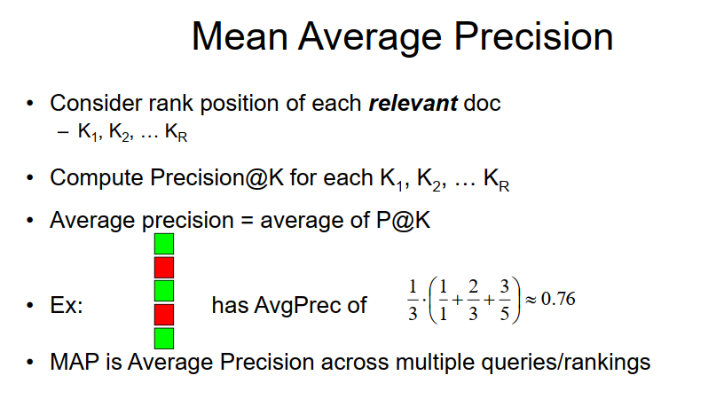
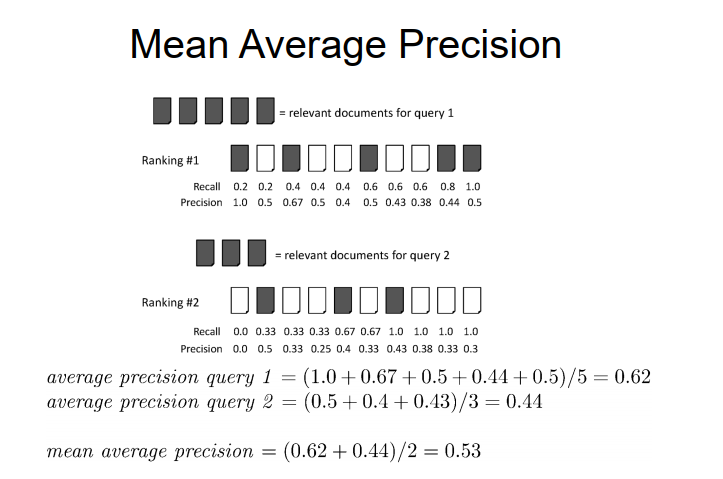
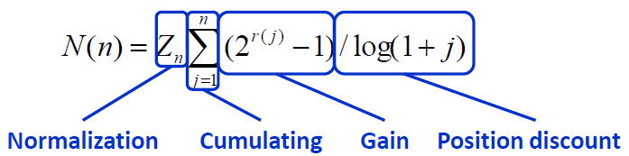

# Experiment-1.3

# IR Evaluation
<br>

### 一、实验要求

#### 1.输入输出要求：

##### 在Homework1.2的基础上实现IR Evaluation

• **指标评价方法**：

&emsp; (1) Mean Average Precision (MAP)

&emsp; (2) Mean Reciprocal Rank (MRR)

&emsp; (3) Normalized Discounted Cumulative Gain (NDCG)

• **Input**： a query (like Ron Weasley birthday)

• **Output**: Return the top K (e.g.,K = 10) relevant tweets.

• **Query**：支持and, or ,not；查询优化可以选做；

#### 2.评价方法解释

• **(1) MAP**:




**MAP example**



• **(2) MRR**:

**Consider rank position, K, of first relevant doc**

&emsp;Could be – only clicked doc

**Reciprocal Rank score =1/K**

**MRR is the mean RR across multiple queries**

• **(3) NDCG**:



### 二、实验步骤

#### 1.针对query以及自己的检索系统生成结果

&emsp;(1)首先，对55个queries(对应文件MB172-225.txt)进行格式化处理，得到num 和 query 内容的对应文件(MB-out.txt)。

**结果展示如下：**


&emsp;(2)将得到的55个query作为输入导入自己在Homework1-2中建立的检索系统中，将返回的结果(已经使用lncltn排序)导出到文件(my_query_result.txt)，同时，返回对应的tweetid。

```python
def generate_query_result():
    input_query=open("MB-out.txt",'r')
    output_query=open("my_query_result.txt",'w')
    for line in input_query.readlines():
        query = line[4:]
        terms = split_input1(query)
        answer = lncltn(terms,100)
        for docid in answer:
            output_query.write(line[:3]+' '+str(tweet_id[docid-1]))

```


#### 2. Evaluation


**(1) MAP**

&emsp;针对每一个query得到的词典，遍历每一个元素keys，如果出现在真实列表中，那么i_retrieval_true+1，同时，使用列表存储其查询精度，最后计算均值。其中AP_result 的列表长度为55，即对应55个queries。

**相关代码如下：**
```python
def MAP_eval(qrels_dict, test_dict, k = 100):
    AP_result = []
    for query in qrels_dict:
        test_result = test_dict[query]
        true_list = set(qrels_dict[query].keys())
        length_use = min(k, len(test_result))
        if length_use <= 0:
            print('query ', query, ' not found test list')
            return []
        P_result = []
        i = 0
        i_retrieval_true = 0
        for doc_id in test_result[0: length_use]:
            i += 1
            if doc_id in true_list:
                i_retrieval_true += 1
                P_result.append(i_retrieval_true / i)
        if P_result:
            #如果列表非空
            AP = np.sum(P_result) / len(true_list)
            #print('query:', query, ',AP:', AP)
            AP_result.append(AP)
        else:
            print('query:', query, ' not found a true value')
            AP_result.append(0)
    return np.mean(AP_result)
```

**(2) MRR**

相对于MAP，此处实现在原来MAP的基础上，将P_result每次添加的元素更改为1/i_retrieval_true即可。


**(3) NDCG**

首先从词典中获取relevance，然后计算DCG，IDCG，累加求和，并做商，得到NDCG，返回均值。
相关代码如下
```python
#c从词典中获取relevance
rel = qrels_dict[query].get(doc_id, 0)
#计算DCG
DCG += (pow(2, rel) - 1) / math.log(i, 2)
#计算IDCG
IDCG += (pow(2, true_list[i - 2]) - 1) / math.log(i, 2)
```

**注意：**用于计算三种评价结果的时候使用的字典长度是取的设定长度k和检索结果，真实结果之间的最小值，其中k设置为100.

### 三、实验结果

#### 1.三种评估方法计算结果

MAP = 0.5878977903503264

MRR = 0.07691985298775675

NDCG = 0.7433658618001409


#### 1.MAP计算结果

query: 171 ,AP: 0.9947950067063025 

query: 172 ,AP: 0.3412969283276451 

query: 173 ,AP: 0.5394754998726596 

query: 174 ,AP: 0.8594866486170832 

query: 175 ,AP: 0.38910505836575876 

query: 176 ,AP: 0.9603814704708716 

query: 177 ,AP: 0.5830572602784104 

query: 178 ,AP: 0.438627515491519 

query: 179 ,AP: 1.0001411305036154 

query: 180 ,AP: 0.17271157167530224 

query: 181 ,AP: 0.9907216297825171 

query: 182 ,AP: 0.19305019305019305 

query: 183 ,AP: 0.425531914893617 

query: 184 ,AP: 0.5423412510980962 

query: 185 ,AP: 0.8199044147573558 

query: 186 ,AP: 0.7233610670784951 

query: 187 ,AP: 1.0 

query: 188 ,AP: 0.421163904805062 

query: 189 ,AP: 0.4508922159542227 

query: 190 ,AP: 0.7537282817812078 

query: 191 ,AP: 0.7057554528997615 

query: 192 ,AP: 0.6922999228607892 

query: 193 ,AP: 0.42238806808196444 

query: 194 ,AP: 1.0 

query: 195 ,AP: 0.2560349838004482 

query: 196 ,AP: 0.7325351726699327 

query: 197 ,AP: 0.8562573583144859 

query: 198 ,AP: 0.49210314303337777 

query: 199 ,AP: 0.22671242168815173 

query: 200 ,AP: 0.38862739161597376 

query: 201 ,AP: 0.37037037037037035 

query: 202 ,AP: 0.6802721088435374 

query: 203 ,AP: 0.05273494125433347 

query: 204 ,AP: 0.91558996232712 

query: 205 ,AP: 0.6060606060606061 

query: 206 ,AP: 0.8236821916487197 

query: 207 ,AP: 0.7967834480252561 

query: 208 ,AP: 0.303951367781155 

query: 209 ,AP: 0.16447368421052633 

query: 210 ,AP: 0.6990236536846707 

query: 211 ,AP: 0.9803113422859036 

query: 212 ,AP: 0.5672131465022131 

query: 213 ,AP: 0.3944223107569721 

query: 214 ,AP: 0.704225352112676 

query: 215 ,AP: 0.2968099047773077 

query: 216 ,AP: 0.5608453490673353 

query: 217 ,AP: 0.41654804942768286 

query: 218 ,AP: 0.20266634248258106 

query: 219 ,AP: 0.3846409988437892 

query: 220 ,AP: 0.5545262789781155 

query: 221 ,AP: 0.1988071570576541 

query: 222 ,AP: 0.5175179813421751 

query: 223 ,AP: 0.8467824507971156 

query: 224 ,AP: 0.9376190476190477 

query: 225 ,AP: 0.9860135445362719 


###### MAP = 0.5878977903503264


#### 2.MRR计算结果

query: 171 ,RR: 1.0 

query: 172 ,RR: 1.0 

query: 173 ,RR: 1.0 

query: 174 ,RR: 1.0 

query: 175 ,RR: 1.0 

query: 176 ,RR: 1.0 

query: 177 ,RR: 1.0 

query: 178 ,RR: 1.0 

query: 179 ,RR: 1.0 

query: 180 ,RR: 1.0 

query: 181 ,RR: 1.0 

query: 182 ,RR: 1.0 

query: 183 ,RR: 1.0 

query: 184 ,RR: 1.0 

query: 185 ,RR: 1.0 

query: 186 ,RR: 1.0 

query: 187 ,RR: 1.0 

query: 188 ,RR: 1.0 

query: 189 ,RR: 0.5 

query: 190 ,RR: 1.0 

query: 191 ,RR: 1.0 

query: 192 ,RR: 1.0 

query: 193 ,RR: 1.0 

query: 194 ,RR: 1.0 

query: 195 ,RR: 1.0 

query: 196 ,RR: 1.0 

query: 197 ,RR: 1.0 

query: 198 ,RR: 1.0 

query: 199 ,RR: 1.0 

query: 200 ,RR: 1.0 

query: 201 ,RR: 1.0 

query: 202 ,RR: 1.0 

query: 203 ,RR: 1.0 

query: 204 ,RR: 1.0 

query: 205 ,RR: 1.0 

query: 206 ,RR: 1.0 

query: 207 ,RR: 1.0 

query: 208 ,RR: 1.0 

query: 209 ,RR: 1.0 

query: 210 ,RR: 1.0 

query: 211 ,RR: 1.0 

query: 212 ,RR: 1.0 

query: 213 ,RR: 1.0 

query: 214 ,RR: 1.0 

query: 215 ,RR: 1.0 

query: 216 ,RR: 1.0 

query: 217 ,RR: 1.0 

query: 218 ,RR: 1.0 

query: 219 ,RR: 1.0 

query: 220 ,RR: 1.0 

query: 221 ,RR: 1.0 

query: 222 ,RR: 1.0 

query: 223 ,RR: 1.0 

query: 224 ,RR: 1.0 

query: 225 ,RR: 1.0 

###### MRR = 0.990909090909091

#### 3.NDCG计算结果

query 171 , NDCG:  0.9741610197285601 

query 172 , NDCG:  0.976267598809695 

query 173 , NDCG:  0.5592590647689766 

query 174 , NDCG:  0.8364253447569288 

query 175 , NDCG:  0.6481396108560767 

query 176 , NDCG:  0.8607975082008584 

query 177 , NDCG:  0.7362022229001453 

query 178 , NDCG:  0.7771970058688653 

query 179 , NDCG:  0.96946915554352 

query 180 , NDCG:  0.43205406604871577 

query 181 , NDCG:  0.8865660618037104 

query 182 , NDCG:  0.5227146959249794 

query 183 , NDCG:  1.0 

query 184 , NDCG:  0.6805789326304771 

query 185 , NDCG:  0.8536744468767384 

query 186 , NDCG:  0.6996910251929338 

query 187 , NDCG:  0.9062438337772172 

query 188 , NDCG:  0.5626660880576555 

query 189 , NDCG:  0.4170732335649429 

query 190 , NDCG:  0.8439560422299328 

query 191 , NDCG:  0.780189037436402 

query 192 , NDCG:  0.7775990358623345 

query 193 , NDCG:  0.46137674288579106 

query 194 , NDCG:  1.0 

query 195 , NDCG:  0.6356537900281565 

query 196 , NDCG:  0.798294443193272 

query 197 , NDCG:  0.8637684507936801 

query 198 , NDCG:  0.5220037900726465 

query 199 , NDCG:  0.8677298107993553 

query 200 , NDCG:  0.8009652862772505 

query 201 , NDCG:  0.8077484806346881 

query 202 , NDCG:  0.8543331297975348 

query 203 , NDCG:  0.12522882485450773 

query 204 , NDCG:  0.8784346866117554 

query 205 , NDCG:  0.9532952623976307 

query 206 , NDCG:  0.8058756222121726 

query 207 , NDCG:  0.8374230518564247 

query 208 , NDCG:  0.5709411792416991 

query 209 , NDCG:  0.7172353312046215 

query 210 , NDCG:  0.8163912308671866 

query 211 , NDCG:  0.7995900380838883 

query 212 , NDCG:  0.835975832240164 

query 213 , NDCG:  0.976225496425557 

query 214 , NDCG:  0.8275209448618122 

query 215 , NDCG:  0.5215776530389581 

query 216 , NDCG:  0.7791603659101373 

query 217 , NDCG:  0.615149844314422 

query 218 , NDCG:  0.7015111678704105 

query 219 , NDCG:  0.5035965470989827 

query 220 , NDCG:  0.5808288255962232 

query 221 , NDCG:  0.8175278490834343 

query 222 , NDCG:  0.45954898946439116 

query 223 , NDCG:  0.6904517181453386 

query 224 , NDCG:  0.9090714260165482 

query 225 , NDCG:  0.8497615562894512 

###### NDCG = 0.7433658618001409


### 四、实验分析与总结

##### (1) 实验中采用MAP，MRR，NDCG三种方式对homework1-2中建立的检索系统进行了评估，掌握了检索评价的方式。

##### (2)对于文本数据或者格式化文本数据的处理更加得心应手。
