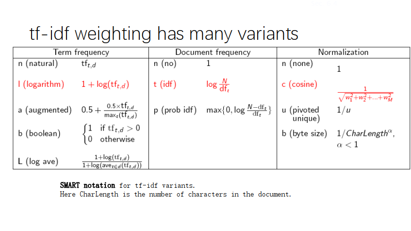
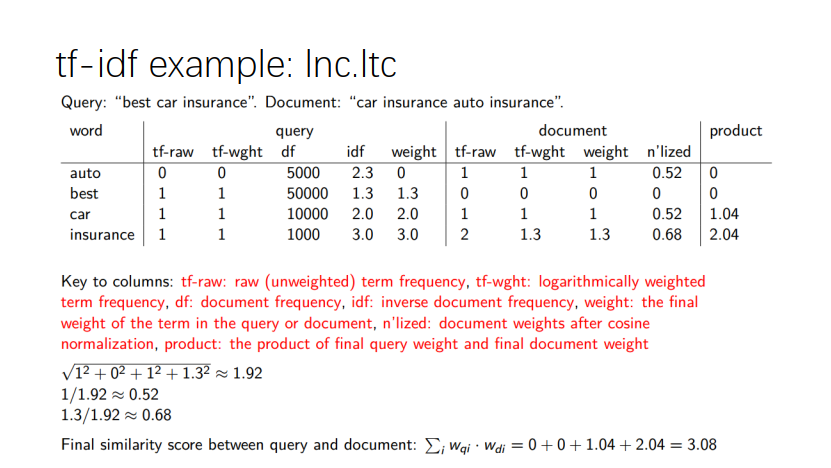
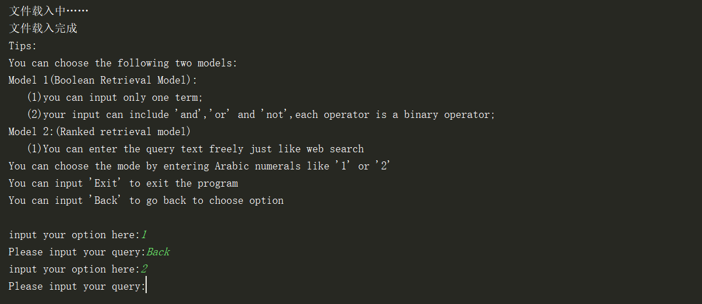
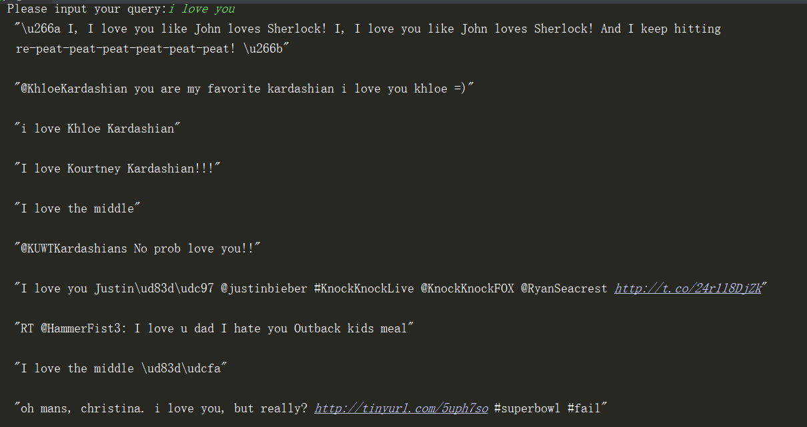
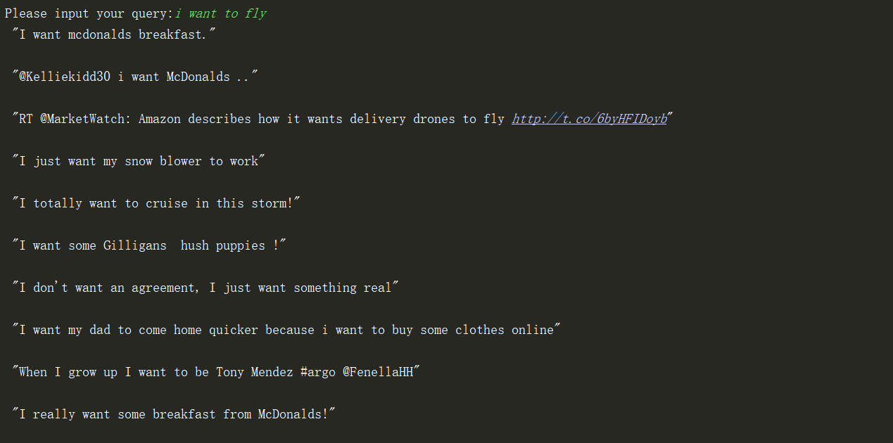

# Experiment-1.2

# Ranked retrieval model
<br>

### 一、实验要求


#### 1.输入输出要求：

##### 在Homework1.1的基础上实现最基本的Ranked retrieval model

• **Input**： a query (like Ron Weasley birthday)

• **Output**: Return the top K (e.g.,K = 10) relevant tweets.

• **Query**：支持and, or ,not；查询优化可以选做；

#### 2.Use SMART notation: lnc.ltc

• **Document**: logarithmic tf (l as first character), no idf and cosine
normalization

• **Query**: logarithmic tf (l in leftmost column), idf (t in second column), no
normalization

#### 3.改进Inverted index

• 在Dictionary中存储每个term的DF

• 在posting list中存储term在每个doc中的TF with pairs (docID, tf)

#### 4.选做

• 支持所有的SMART Notations。

### 二、实验步骤

#### 1.创建新的倒排索引记录表(二元组)

&emsp;(1)首先，计算每个doc中每个term出现的频率，并计算如下：
$tf_{t,d}=1+log(tf_{t,d}\)$
)
然后，对得到的数值进行归一化(normalization)。


&emsp;(2)计算df和idf，即文档频率以及逆文档频率。其中idf=log(N/df)

&emsp;(3)将原来的postings以及现在的postings_for_topk，以及document(存放逆文档频率的字典)保存成文件，使用numpy中的save函数保存为npy文件。

修正后的get_postings代码如下：
```python
def get_postings():
    global postings
    global all
    global postings
    f = open("tweets1.txt", 'r')
    lines=f.readlines()
    i=1
    for line in lines:
        all.append(i)
        line=preprocess(line)
        #print(line)
        #计算TF
        unique_terms=set(line)
        t1=0
        for every_term in unique_terms:
            #统计TF
            term_frequency =1+math.log10(line.count(every_term))
            t1+=term_frequency*term_frequency
            #print(term_frequency)
            if every_term in postings.keys():
                postings[every_term].append(i)
            else:
                postings[every_term]=[i]

        ans1=math.sqrt(t1)
        for every_term in unique_terms:
            term_frequency = 1 + math.log10(line.count(every_term))
            #重新计算一次，保存到二元组中的数值为归一化之后的数值
            if every_term in postings_for_topk.keys():
                postings_for_topk[every_term].append((i, term_frequency/ans1))
            else:
                postings_for_topk[every_term] = [(i, term_frequency/ans1)]

        #计算文档频率
        for every_term in unique_terms:
            if every_term in document.keys():
                document[every_term]+=1
            else:
                document[every_term]=1
        i=i+1

    number=i-1
    #计算idf
    for every_key in document.keys():
        document[every_key]=math.log10(float(number)/document[every_key])

    np.save("idf.npy",document)
    np.save("postings.npy",postings)
    np.save("postings_for_topk.npy",postings_for_topk)
    # print(all)
    print("预处理完成")
    print("文本数量共计：",number,"项")
    print("倒排索引记录表建立完成")
```

**注意**：postings，postings_for_topk,document都是词典 是在全局声明的。

#### 2.Use SMART notation: lnc.ltc


**参考计算方式如下图：**





&emsp;(1) 将query分成多个term，在postings_for_topk中可以返回一串二元组，每个二元组包含了docID以及tf，根据公式计算并累加求和得到针对相关句子的score。

&emsp;(2) 根据score对涉及到的句子分数从高到低进行排序，选择topk个相关的句子，如果涉及到的句子不足topk个，那么直接把所有的句子由相似度从高到低输出。

相关代码如下
```python
def lncltc(terms):
    # 计算tf
    query_dict = {}
    unique_terms = set(terms)
    score = {}

    # 计算涉及到的doc的分数
    for every_term in unique_terms:
        query_dict[every_term] = 1 + math.log10(terms.count(every_term))
        for every_tuple in postings_for_topk[every_term]:
            # 对应的tf
            if every_tuple[0] in score.keys():
                score[every_tuple[0]]\
                    += query_dict[every_term] * document[every_term] * every_tuple[1]
            else:
                score.update({every_tuple[0]:
                                  query_dict[every_term] * document[every_term] * every_tuple[1]})
    # 根据分数对score字典进行排序
    ans = sorted(score.items(), key=lambda item: item[1], reverse=True)
    #print(ans)
    answer = []
    if len(ans) <= topK:
        for every_doc in ans:
            answer.append(every_doc[0])
    else:
        temp = ans[:topK]
        for every_doc in temp:
            answer.append(every_doc[0])
    return answer


```
#### 3.已保存变量载入

载入保存的文件，而不是像第一个实验中动态建立，可以加快运行速度。

```python
def load_npy():
    print("文件载入中……")
    document=np.load("idf.npy").item()
    postings=np.load("postings.npy").item()
    postings_for_topk=np.load("postings_for_topk.npy").item()
    tweet_text = open("tweet_text.txt", 'r+').readlines()
    print("文件载入完成")
    return document,postings,postings_for_topk,tweet_text
```

#### 4.设计简单交互和运行提示


```python
def search2():
    global postings
    global postings_for_topk
    global tweet_text
    input_str = input("Please input your query:")
    if input_str=="Exit":
        exit(0)
    if input_str == "Back":
        return False
    terms = split_input1(input_str)
    answer=lncltc(terms)

    for docid in answer:
        print(tweet_text[docid-1])

    return True


def choose_model():
    print("Tips:\n"
          "You can choose the following two models:\n"
          "Model 1(Boolean Retrieval Model):\n"
          "   (1)you can input only one term;\n"
          "   (2)your input can include 'and','or' and 'not',each operator is a binary operator;\n"
          "Model 2:(Ranked retrieval model)\n"
          "   (1)You can enter the query text freely just like web search\n"
          "You can choose the mode by entering Arabic numerals like '1' or '2'\n"
          "You can input 'Exit' to exit the program\n"
          "You can input 'Back' to go back to choose option\n")
    while True:
        opt=int(input("input your option here:"))
        if opt==1:
            while search1():
                pass
        elif opt==2:
            while search2():
                pass
        else:
            print("No such option")

```


### 三、实验结果

#### 1.界面与返回功能



#### 2.Ranked retrieval model

此处取topk=10

**Test1：**




**Test2**



### 四、实验改进与不足

##### (1) 实验中将倒排索引记录表存储在文件中，方便了每次直接从文件中读取变量。

##### (2)对于tweet数据集只保留了text信息，同时，对每一行文本使用集合set处理，同时保留了词频的信息。
