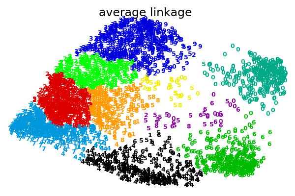

# Experiment-2

# Clustering with sklearn
<br>


### 一、实验要求

#### 1.测试sklearn中以下聚类算法在以上两个数据集上的聚类效果：

##### 数据集如下：


##### 聚类算法：


#### 2.Evaluation

##### 聚类方法评价


### 二、实验步骤

#### 1.了解实验数据集

##### 1.1 通用数据集 API

根据所需数据集的类型，有三种主要类型的数据集API接口可用于获取数据集。

* **loaders** 可用来加载小的标准数据集,在[玩具数据集](#62-玩具数据集)中有介绍。
* **fetchers** 可用来下载并加载大的真实数据集,在[真实世界中的数据集](#63-真实世界中的数据集)中有介绍。

loaders和fetchers的所有函数都返回一个字典一样的对象，里面至少包含两项:shape为n_samples*n_features的数组，对应的字典key是data(20news groups数据集除外)以及长度为n_samples的numpy数组,包含了目标值,对应的字典key是`target`。

通过将`return_X_y`参数设置为True，几乎所有这些函数都可以将输出约束为只包含数据和目标的元组。

数据集还包含一些对`DESCR`描述，同时一部分也包含`feature_names`和`target_names`的特征。有关详细信息，请参阅下面的数据集说明

* **generation functions** 它们可以用来生成受控的合成数据集(synthetic datasets),在人工合成的数据集中有介绍。

这些函数返回一个元组(X,y)，该元组由shape为n_samples*n_features的numpy数组X和长度为n_samples的包含目标y的数组组成。

此外，还有一些用于加载其他格式或其他位置的数据集的混合工具(miscellanous tools),在[加载其他类型的数据集](#65-加载其他数据集)中有介绍

##### 1.2 玩具数据集

scikit-learn 内置有一些小型标准数据集，不需要从某个外部网站下载任何文件。

|调用|描述|
|---|---|
| [`load_boston`](https://scikit-learn.org/stable/modules/generated/sklearn.datasets.load_boston.html#sklearn.datasets.load_boston "sklearn.datasets.load_boston")([return_X_y]) | Load and return the boston house-prices dataset (regression). |
| [`load_iris`](https://scikit-learn.org/stable/modules/generated/sklearn.datasets.load_iris.html#sklearn.datasets.load_iris "sklearn.datasets.load_iris")([return_X_y]) | Load and return the iris dataset (classification). |
| [`load_diabetes`](https://scikit-learn.org/stable/modules/generated/sklearn.datasets.load_diabetes.html#sklearn.datasets.load_diabetes "sklearn.datasets.load_diabetes")([return_X_y]) | Load and return the diabetes dataset (regression). |
| [`load_digits`](https://scikit-learn.org/stable/modules/generated/sklearn.datasets.load_digits.html#sklearn.datasets.load_digits "sklearn.datasets.load_digits")([n_class, return_X_y]) | Load and return the digits dataset (classification). |


这些数据集有助于快速说明在 scikit 中实现的各种算法的行为。然而，它们数据规模往往太小，无法代表真实世界的机器学习任务。

**实验中用到的第一个数据集即是load_digits玩具数据集**

##### 1.3 真实世界中的数据集

scikit-learn 提供加载较大数据集的工具，并在必要时下载这些数据集。

这些数据集可以用下面的函数加载 :

|调用|描述|
|---|---|
|[fetch_olivetti_faces](https://scikit-learn.org/stable/modules/generated/sklearn.datasets.fetch_olivetti_faces.html#sklearn.datasets.fetch_olivetti_faces)([data_home, shuffle, …])|Load the Olivetti faces data-set from AT&T (classification).|
|[fetch_20newsgroups](https://scikit-learn.org/stable/modules/generated/sklearn.datasets.fetch_20newsgroups.html#sklearn.datasets.fetch_20newsgroups)([data_home, subset, …])|Load the filenames and data from the 20 newsgroups dataset (classification).|
|[fetch_20newsgroups_vectorized](https://scikit-learn.org/stable/modules/generated/sklearn.datasets.fetch_20newsgroups_vectorized.html#sklearn.datasets.fetch_20newsgroups_vectorized)([subset, …])|Load the 20 newsgroups dataset and vectorize it into token counts (classification).|

**实验中用到的第二个数据集即为fetch_20newsgroups真实数据集。**

#### 2.实验中涉及的聚类算法

##### 2.1 k-means

[`KMeans`](https://scikit-learn.org/stable/modules/generated/sklearn.cluster.KMeans.html#sklearn.cluster.KMeans "sklearn.cluster.KMeans") 算法通过把样本分离成 n 个具有相同方差的类的方式来聚集数据，最小化称为 惯量([inertia](inertia)) 或 簇内平方和(within-cluster sum-of-squares)的标准（criterion）。该算法需要指定簇的数量。K-means（K-均值）算法旨在选择一个质心, 能够最小化惯性或簇内平方和的标准。

##### 2.2 Affinity Propagation

[`AffinityPropagation`](https://scikit-learn.org/stable/modules/generated/sklearn.cluster.AffinityPropagation.html#sklearn.cluster.AffinityPropagation "sklearn.cluster.AffinityPropagation") AP聚类是通过在样本对之间发送消息直到收敛的方式来创建聚类。然后使用少量模范样本作为聚类中心来描述数据集，而这些模范样本可以被认为是最能代表数据集中其它数据的样本。在样本对之间发送的消息表示一个样本作为另一个样本的模范样本的 适合程度，适合程度值在根据通信的反馈不断更新。更新迭代直到收敛，完成聚类中心的选取，因此也给出了最终聚类。

##### 2.3 Mean Shift

[`MeanShift`](https://scikit-learn.org/stable/modules/generated/sklearn.cluster.MeanShift.html#sklearn.cluster.MeanShift "sklearn.cluster.MeanShift") 算法旨在于发现一个样本密度平滑的 _blobs_ 。均值漂移(Mean Shift)算法是基于质心的算法，通过更新质心的候选位置，这些侯选位置通常是所选定区域内点的均值。然后，这些候选位置在后处理阶段被过滤以消除近似重复，从而形成最终质心集合。

##### 2.4 Spectral clustering

[`SpectralClustering(谱聚类)`](https://scikit-learn.org/stable/modules/generated/sklearn.cluster.SpectralClustering.html#sklearn.cluster.SpectralClustering "sklearn.cluster.SpectralClustering") 是在样本之间进行关联矩阵的低维度嵌入，然后在低维空间中使用 KMeans 算法。 如果关联矩阵稀疏并且 [pyamg](http://pyamg.org/) 模块已经被安装，则这是非常有效的。 谱聚类 需要指定簇的数量。这个算法适用于簇数量少时，在簇数量多时是不建议使用。

##### 2.5 层次聚类

 层次聚类(Hierarchical clustering)代表着一类的聚类算法，这种类别的算法通过不断的合并或者分割内置聚类来构建最终聚类。 聚类的层次可以被表示成树（或者树形图(dendrogram)）。树根是拥有所有样本的唯一聚类，叶子是仅有一个样本的聚类。 

##### 2.6. 添加连接约束

[`AgglomerativeClustering`](https://scikit-learn.org/stable/modules/generated/sklearn.cluster.AgglomerativeClustering.html#sklearn.cluster.AgglomerativeClustering "sklearn.cluster.AgglomerativeClustering") 中一个有趣的特点是可以使用连接矩阵(connectivity matrix)将连接约束添加到算法中（只有相邻的聚类可以合并到一起），连接矩阵为每一个样本给定了相邻的样本。 例如，在 swiss-roll 的例子中，连接约束禁止在不相邻的 swiss roll 上合并，从而防止形成在 roll 上重复折叠的聚类。


##### 2.7 DBSCAN

The [`DBSCAN`](https://scikit-learn.org/stable/modules/generated/sklearn.cluster.DBSCAN.html#sklearn.cluster.DBSCAN "sklearn.cluster.DBSCAN") 算法将簇视为被低密度区域分隔的高密度区域。由于这个相当普遍的观点， DBSCAN发现的簇可以是任何形状的，与假设簇是凸的 K-means 相反。 DBSCAN 的核心概念是 _core samples_, 是指位于高密度区域的样本。 因此一个簇是一组核心样本，每个核心样本彼此靠近（通过某个距离度量测量） 和一组接近核心样本的非核心样本（但本身不是核心样本）。算法中的两个参数, `min_samples` 和 `eps`,正式的定义了我们所说的 _稠密（dense）_。较高的 `min_samples` 或者较低的 `eps` 都表示形成簇所需的较高密度。

##### 2.8 Gaussian mixtures

 [`GaussianMixture`](https://scikit-learn.org/stable/modules/generated/sklearn.mixture.GaussianMixture.html#sklearn.mixture.GaussianMixture "sklearn.mixture.GaussianMixture") 对象实现了用来拟合高斯混合模型的 [期望最大化](#expectation-maximization) (EM) 算法。它还可以为多变量模型绘制置信椭圆体，同时计算 BIC（Bayesian Information Criterion，贝叶斯信息准则）来评估数据中聚类的数量。而其中的[`GaussianMixture.fit`](https://scikit-learn.org/stable/modules/generated/sklearn.mixture.GaussianMixture.html#sklearn.mixture.GaussianMixture.fit "sklearn.mixture.GaussianMixture.fit") 方法可以从训练数据中拟合出一个高斯混合模型。


#### 3. Clustering performance evaluation

度量聚类算法的性能不是简单的统计错误的数量或计算监督分类算法中的 准确率(precision)和 召回率(recall)。 特别地，任何度量指标（evaluation metric）不应该考虑到簇标签的绝对值，而是如果这个聚类方式所分离数据类似于部分真实簇分类 (ground truth set of classes _注：gorund truth指的是真实值，在这里理解为标准答案_)或者满足某些假设，在同于一个相似性度量（similarity metric）之下,使得属于同一个类内的成员比不同类的成员更加类似。

设计evaluation函数如下：

```python

def evaluation(labels_true,labels_pred):
    print("Normalized Mutual Information:%0.3f"%
          metrics.normalized_mutual_info_score(labels_true,labels_pred))
    print("Homogeneity: %0.3f" %
          metrics.homogeneity_score(labels_true, labels_pred))
    print("Completeness: %0.3f" %
          metrics.completeness_score(labels_true, labels_pred))
    print()
```

其中，分别代表了三种评测指标，NMI，homegeneity，以及completeness。传入参数分别为真实标签以及预测标签。

### 三、实验结果

##### (1.1) Kmeans for digits

Normalized Mutual Information:0.465

Homogeneity: 0.459

Completeness: 0.472


核心代码如下：
```python
digits = load_digits()
data = scale(digits.data) #数据标准化

# 1794 64
n_samples, n_features = data.shape
n_digits = len(np.unique(digits.target))
labels = digits.target
reduced_data = PCA(n_components=2).fit_transform(data)
kmeans = KMeans(init='k-means++', n_clusters=n_digits, n_init=10)
kmeans.fit(reduced_data)
labels_pred=kmeans.fit_predict(reduced_data)
evaluation(labels,labels_pred)
```
##### (1.2) AffinityPropagation for digits

Normalized Mutual Information:0.618

Homogeneity: 0.601

Completeness: 0.636


核心代码如下：
```python
digits = load_digits()
data = scale(digits.data) #数据标准化
n_samples, n_features = data.shape
n_digits = len(np.unique(digits.target))
X=data
af = AffinityPropagation(preference=-3100).fit(X)
cluster_centers_indices = af.cluster_centers_indices_
labels = af.labels_
# centroids = af.cluster_centers_
# print(centroids)
n_clusters_ = len(cluster_centers_indices)
labels_true=digits.target    #样本真实标签
evaluation(labels_true,labels)
data_tsne = TSNE(learning_rate=100).fit_transform(data)
colors = [['red','green','blue','grey','yellow',
           'cyan','black','white','blue','black'][i] for i in labels]
'''绘制聚类图'''
plt.scatter(data_tsne[:,0],data_tsne[:,1],c=colors,s=10)
plt.title('AP_digits')
plt.show()

```

##### (1.3) Mean-shift for digits

Normalized Mutual Information:0.043

Homogeneity: 0.007

Completeness: 0.256


```python
digits = load_digits()
data = scale(digits.data) #数据标准化
#data=digits.data
n_samples, n_features = data.shape
n_digits = len(np.unique(digits.target))
labels_true=digits.target
X=data
bandwidth = estimate_bandwidth(X, quantile=0.4, n_samples=500)
ms = MeanShift(bandwidth=bandwidth, bin_seeding=True)
ms.fit(X)
labels = ms.labels_
cluster_centers = ms.cluster_centers_
print(cluster_centers.shape)
labels_unique = np.unique(labels)
print(labels_unique)
n_clusters_ = len(labels_unique)
evaluation(labels_true,labels)
```

##### (1.4) Mean-shift for digits

Normalized Mutual Information:0.295

Homogeneity: 0.161

Completeness: 0.541


```python
digits = load_digits()
data = scale(digits.data) #数据标准化

n_samples, n_features = data.shape
n_digits = len(np.unique(digits.target))
labels_true=digits.target
reduced_data = PCA(n_components=2).fit_transform(data)
# print(reduced_data.shape)
X=reduced_data
# X=data
sc=SpectralClustering(n_clusters=10).fit(X)
labels = sc.labels_

evaluation(labels_true,labels)
```


##### (1.5) Ward for digits


Normalized Mutual Information:0.521

Homogeneity: 0.511

Completeness: 0.531


##### (1.6) Agglomerative for digits

Normalized Mutual Information:0.526

Homogeneity: 0.502

Completeness: 0.551



核心代码如下：

```python
from sklearn.cluster import AgglomerativeClustering

for linkage in ('ward', 'average', 'complete', 'single'):
    clustering = AgglomerativeClustering(linkage=linkage, n_clusters=10)
    t0 = time()
    clustering.fit(X_red)
    print("%s :\t%.2fs" % (linkage, time() - t0))
    # evaluation(y,clustering.labels_)
    plot_clustering(X_red, clustering.labels_, "%s linkage" % linkage)
```

##### (1.7) DBSCAN for digits

Normalized Mutual Information:0.332

Homogeneity: 0.258

Completeness: 0.427


```python
X=data

X = StandardScaler().fit_transform(X)
print(X.shape)
X = PCA(n_components=2).fit_transform(X)

# #############################################################################
# Compute DBSCAN
db = DBSCAN(eps=0.354, min_samples=10).fit(X)
core_samples_mask = np.zeros_like(db.labels_, dtype=bool)
core_samples_mask[db.core_sample_indices_] = True
labels = db.labels_
evaluation(labels_true,labels)
```

##### (1.8) Guass for digits

Normalized Mutual Information:0.469

Homogeneity: 0.462

Completeness: 0.476


```python
digits = load_digits()
data = scale(digits.data) #数据标准化
n_samples, n_features = data.shape
n_digits = len(np.unique(digits.target))
reduced_data = PCA(n_components=2).fit_transform(data)
# print(reduced_data.shape)
X=reduced_data
labels_true=digits.target
gmm = GaussianMixture(n_components=10)
gmm.fit(X)
labels = gmm.predict(X)
evaluation(labels_true,labels)
```

** 综合以上评测结果，对于第二种聚类方法相对更加适合这个digits数据集，对于有些聚类方法，在使用前对数据通过PCA进行了降维，同时，可视化显示的时候，应用了TSNE进行降维可视化。**

##### (2.1) kmeans for text

**ordinary kmeans**

Normalized Mutual Information:0.348

Homogeneity: 0.310

Completeness: 0.391

**Minibatch kmeans**

Normalized Mutual Information:0.362

Homogeneity: 0.322

Completeness: 0.408

相比较而言，使用minibatch kmeans做聚类比传统的kmeans效果要好。

##### (2.4) SpectralCoclustering for text

Normalized Mutual Information:0.416

Homogeneity: 0.328

Completeness: 0.528


### 四、实验分析与总结

##### (1) 

##### (2)
